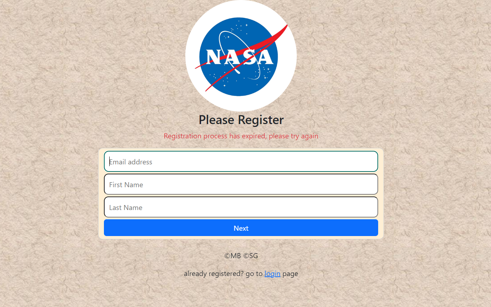
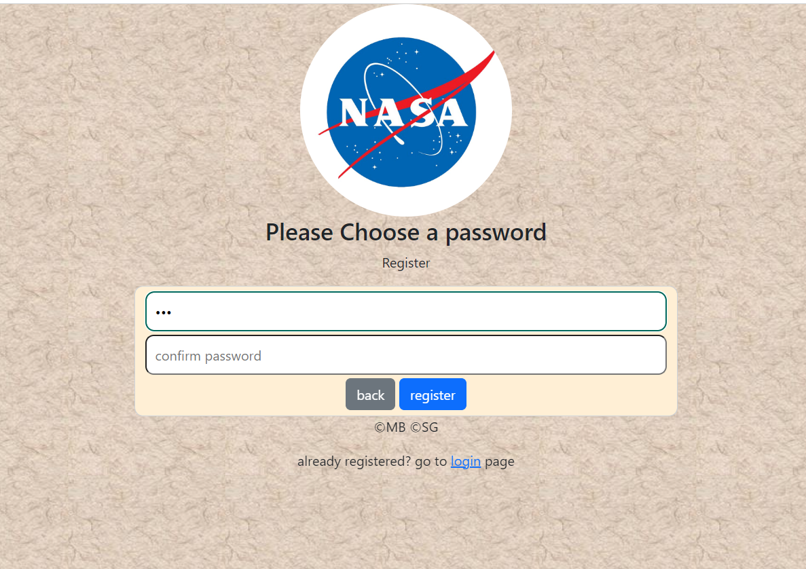
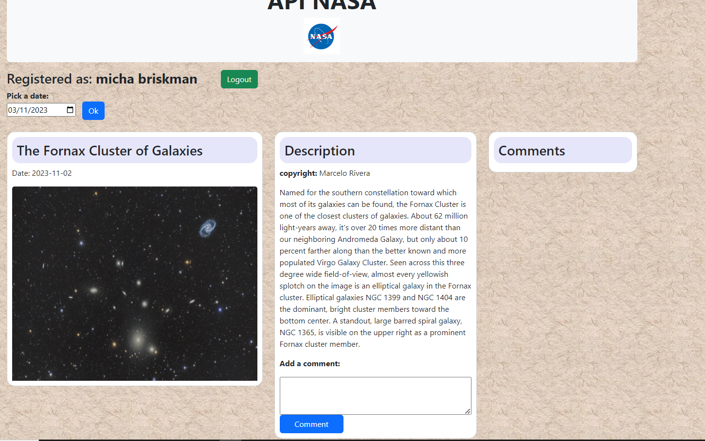
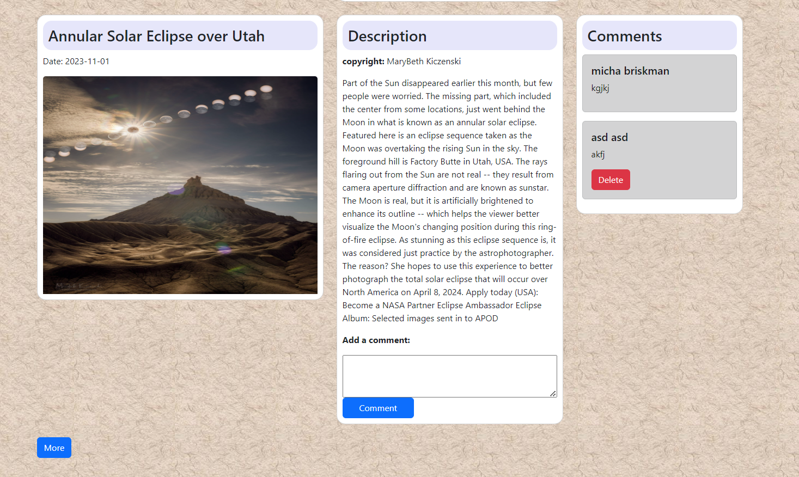
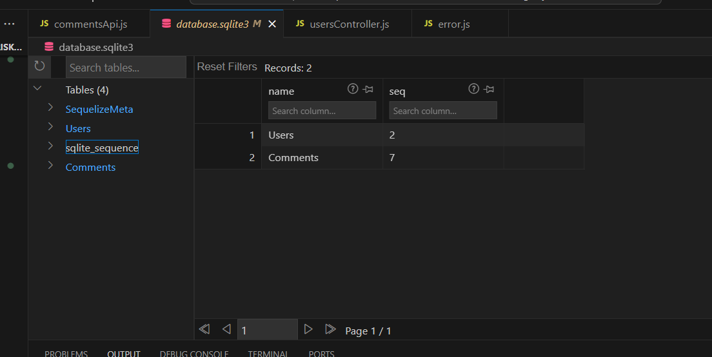

# ex6 MVC (NodeJS-Express-EJS) and database neviim
# Authors: Micha Briskman -  Shlomo Gulayev - 
# Emails: michabri@edu.hac.ac.il, shlomogu@edu.hac.ac.il

In this exercise we made a "social media" site for displaying images of NASA with comments.  
We implemented the client side and the server side with express-ejs. This is part 2. The databases are sqlite models.

User Model: Attributes:
1. id
2. First name
3. Last name
4. email
5. password

Comment Model: Attributes:
1. id
2. email
3. name
4. comment

The first page is the login page (localhost:3000/).  
The page displays a form to login, and a link that links to a register page. 

   
The register page (localhost:3000/users/register) displays a form with an email, a first name and a last name.  
After the submit button the server side checks if the email is already in the database, if it exists, then the program  
displays to the user an error. There is a validation to the form. 

   
Then the user redirects to a password page (localhost:3000/users/register-passwords) where he needs to input a password.  
Then if the user is quick enough to register under 30 seconds he will register successfully. 
We used cookies to remember the values of the first register form. 

   
First the user needs to login to the site, email and password (encrypted with bcrypt). 
When the user is logged in, the site redirects to (localhost:3000/nasa). 
The images are from APOD NASA API. We used the key="Khp4lBmSGAgwQW3VSsFRh2OQLM6Fft82EVEkZW87". 
We fetched data from apiRest of NASA and displayed to our site. 
Then he needs to choose a date of the images he wants to see,  
it'll display the last 3 images from that date.  

   
Then the user can comment to a 
picture how many times he wants, he also can choose to delete 
which ever comment of his. There is also a button more for displaying 3 more images of APOD. 
When the page is refreshed the user is still logged in (it depends if the session is alive). 
If the comment is not the user's comment the button delete is not shown. 
The user can logout from the nasa site. 

   
Session time is 10 min, when the user is logged in.  
Our restApi for the users is the route of loginPage.
Our restApi for the comments is CommentsApi. All the comments are managed on the server side. 
To see all the users that were registered to the site: localhost:3000/users/users. 
To see all the comments that were written to the site: localhost:3000/nasa/comments. 

